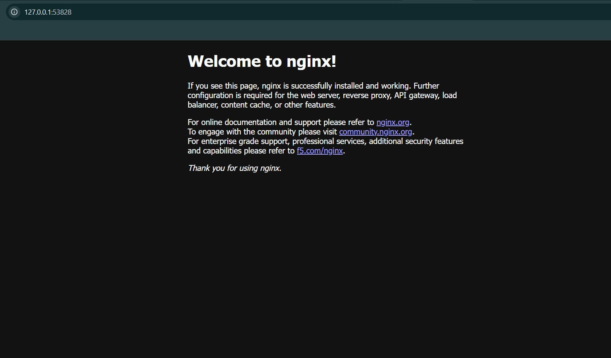

# Exercise 1 — Hello Pod

## Objective
Deploy an Nginx web application as a Kubernetes Pod using Minikube and expose it through a NodePort Service.

## Business Scenario
As a DevOps Engineer at Zepto, the task is to deploy a lightweight storefront application on Kubernetes.

For this exercise, the official Nginx container image simulates the storefront web application.

## Technologies Used
- **Docker:** Container runtime
- **Minikube:** Local Kubernetes cluster
- **Kubernetes:** Container orchestration
- **kubectl:** Kubernetes command-line tool
- **Nginx:** Web server

## Implementation

### 1. Start the Kubernetes Cluster

```bash
minikube start --driver=docker
```

Verify the cluster:

```bash
kubectl get nodes
```

**Result:** The Minikube control-plane node was in the `Ready` state.

### 2. Deploy the Nginx Pod

```bash
kubectl run hello-k8s --image=nginx --port=80
```

Verify the Pod:

```bash
kubectl get pods
```

**Result:** The `hello-k8s` Pod was successfully running with `1/1` containers ready.

### 3. Expose the Pod Using NodePort

```bash
kubectl expose pod hello-k8s --type=NodePort --port=80
```

Verify the Service:

```bash
kubectl get services
```

The NodePort Service makes the application accessible through the Minikube cluster.

### 4. Access the Application

```bash
minikube service hello-k8s
```

**Result:** The browser successfully displayed the default **Welcome to nginx!** page.

## Kubernetes Architecture

```text
          User / Browser
                |
                v
        Minikube Cluster
                |
                v
        NodePort Service
           (hello-k8s)
                |
                v
         Kubernetes Pod
           (hello-k8s)
                |
                v
         Nginx Container
            Port 80
```

## Declarative Deployment

The `k8s.yaml` file defines the Kubernetes Pod and NodePort Service.

To recreate the resources on a fresh cluster:

```bash
kubectl apply -f k8s.yaml
```

Verify the resources:

```bash
kubectl get pods
kubectl get services
```

Access the application:

```bash
minikube service hello-k8s
```

## Useful Kubernetes Commands

| Command | Purpose |
|---|---|
| `kubectl get pods` | List Pods |
| `kubectl get services` | List Services |
| `kubectl describe pod hello-k8s` | Inspect Pod details |
| `kubectl logs hello-k8s` | View container logs |
| `kubectl delete -f k8s.yaml` | Remove the resources defined in the manifest |
| `minikube stop` | Stop the local cluster |

## Troubleshooting

**Error: `pods "hello-k8s" already exists`**

The Pod was already present in the cluster. Verify it using:

```bash
kubectl get pods
```

**Error: `services "hello-k8s" already exists`**

The Service was already present. Verify it using:

```bash
kubectl get services
```

## Learning Outcomes

- Understood the purpose of Kubernetes Pods.
- Started and verified a local Kubernetes cluster.
- Deployed an Nginx container inside a Pod.
- Exposed the application through a NodePort Service.
- Accessed the deployed application using Minikube.
- Created a declarative Kubernetes YAML manifest.

## Application Output

The Nginx application was successfully deployed on Kubernetes and accessed through the NodePort Service.




## Conclusion

Successfully deployed and accessed an Nginx web application using Kubernetes and Minikube.

**Status: Completed ✅**